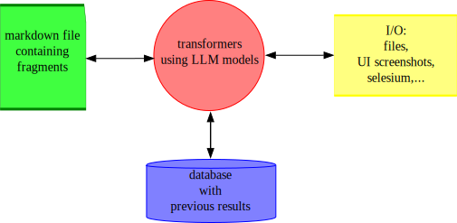

# MarkdownCode

MarkdownCode is an ideation and corpus building/manipulation tool driven by machine learning. It allows users to enter text in markdown of any length, which can be transformed (and reverted) into something else. This is done using transformers that are completely customizable.

Some use cases:
- convert specs to code and keep the specs in sync with the code.
- convert an angular application into a react version.
- render test cases and UI driven tests based on specs and rendered code
- extract and regroup feature definitions (find common features spread out over many code files)
- ...

## The problem(s) it's trying to solve
- Large language models have a limited size: even though models are getting bigger and bigger, you can't just throw any large text to it and have it render any possible code size, for the time being, they still have limits. Some models can handle more tokens than others, but no matter the size of the model, there is a hard limit that determines how much can go in and out in 1 go.
To solve this, the prompt engine splits up the markdown text into smaller chunks and perform the conversions on each of these chunks (text fragment).
- You don't always want to regenerate the entire result / code base, but instead only a couple of features at a time, which is an other great reason to split up the input prompt and use tools to track which parts have become out of date and for which prompts.
- When you are chaining transformers (use the output of a prompt as the input of another prompt), it happens that at some point in the chain, the output of the transformers no longer changes cause the input hasn't changed. In order to prevent unneeded calls to the llm, some more advanced caching and prompt generation is needed. 
- Transforming large corpora (like the full specs of an app) takes a bit of time and requires a lot of calls to the llm. Some models are cheaper and faster but less accurate. Some prompts and text fragments are simple and can be handled by a simpler, faster model. Others need the big guns. In order to optimize speed and cost, you want to be able to determine which model is used by each prompt, and even for each text fragment.
- not all input has the same structure (backend web servers usually don't have much use of UI components), so flexibility in the translation process is needed and you should be able to declare your own prompts.
- For the same reason, some feedback is also useful for tracking what is up-to-date, out-of-date, currently being built or paused for inspection.
- In any large conversion project, errors will occur, so some control and debug ability over the entire conversion process is needed. This is why the output of every step can be examined and manually overwritten and there is full access to the chrome debugger for the custom transformers.

## how it works
When a project is loaded, the markdown is first split up into text fragments. A fragment basically is a header and the text below that header. If the project contains any custom transformers, these are also loaded, otherwise only the default/built-in set of transformers is available.
Next, you select a transformer to be run and the scope (only the currently selected fragment or the entire project). 
Transformers are (shortish) javascript modules that usually call upon an LLM to somehow transform the input. This input can consist out of 1 or more of these fragments, and or the results of other transformers and or any other external data source you can think of.
A transformer will only update it's result if the input it uses to calculate the result, has changed. To accomplish this, each transformer stores all of it's results in a database and monitors changes in the project and all the other transformers it depends on to compare the new input, triggered by a change somewhere else, with the previous input, stored in the database.
Because transformers are just javascript modules, they can do lots of other stuff like writing results to a file, monitor file changes, integrate with selenium or write back to the markdown file.

## transformer libraries
This is a list of transformer-sets that you can use in your own projects as-is or as a starting point for your own libraries:
- built-in: this is the set of transformers that is built into the application and which are used when you open the plugin window to edit your own transformers. The main purpose of this set is to create transformer plugins that can be used for other projects.
- react-client: a set of transformers that can be used for creating/maintaining javascript based front-end apps. This can be for the web or electron. Currently tested for react apps, though I suspect other libraries might also work, except for angular which will probably need some more.

## an example
Take a look at the [definition of the markdown-code editor & compiler](https://github.com/jan-bogaerts/markdownCode/blob/main/src/markdownCode.md).

## Supported Languages

MarkdownCode is currently tested on JavaScript, but it should work with most other programming languages as well, especially with custom prompt pipeline configurations.

## Prerequisites

For windows, the application can be installed from the installer in the release section.
To run from code (javascript/electron/react):
 - go to the folder 'src\generated\code'. There should be a file `package.json`
 - run `npm install` to install all the required packages
 - to start the app, use the npm script `electron:start`

## Markdown File Syntax
There isn't that much structural requirements. The main idea is that the parser will split the text on titles. So a text fragment contains 1 title and all the text below it until another title is found.
That said, in general it is presumed:

- The top title in the markdown file is presumed to be the name of the application.
- The second paragraph is expected to be about the development stack. It is recommended to use this as the title for the paragraph. This is not a requirement of the parser, but is instead used by some transformers. This can be changed in your custom transformers.
- The current set of transformers expects the titles (with subsections) 'services' and 'components' for building applications
- Plugin definitions rely on the constant-extractor transformer, which uses the > sign at the beginning of the line to find constants, ex:

    > this is a constant

## Code Conversion Customization

The application only knows a limited set of hardcoded transformers. These are primarily used for building other transformers. Most of the transformers that you will use are loaded as plugins and can very easily be changed/created by you. Here's the [default set of plugins](https://github.com/jan-bogaerts/markdownCode/blob/main/src/plugins.md) which is also used for building the markdown application itself.

## Installation and Usage

- run the installer
- go to the tab `preferences` and click on the button with a key icon (first one)
- enter your open-ai key
- select a global default model to use
- type some text
- select one of the transformer tabs at the bottom
- go to the transformers menu section and click on the `play` button, which will start the selected transformer for the currently selected text fragment

## Known Limitations or Issues

As this is an active project, new limitations or issues may be discovered. We appreciate your patience and feedback.

## Contribution Guidelines

Contributions are welcome! If you'd like to contribute to the MarkdownCode project, please make a Pull Request (PR) and send it for review.

